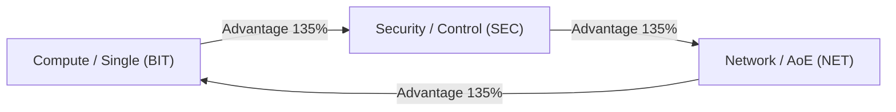

# ⚖️ Cursor Defense - Official Balance Master Datasheet

> **Version**: `v3.6.0` (2026-09-23 Release)  
> **Environment**: 80 Rounds / 1280x720 Viewport / 12 Sockets / 5 Tiers (25 Fixed Units)  
> **Core Objective**: Prevent low-tier multi-hit boss melts post-40R; enforce high-tier (4~5T) elite synthesis consolidation via a 10-level paced gacha overclock economy.

---

## 1. 3-Way Elemental Affinities (Rock-Paper-Scissors)

All 25 units and 8 bosses possess one of three cyber attributes. Damage is scaled according to circular affinity rules.

### [1-1] Attribute Modifier Chart (`ATTRIBUTE_CHART`)

| Attacker \ Defender | Compute (`BIT`) | Security (`SEC`) | Network (`NET`) |
|:---:|:---:|:---:|:---:|
| **Compute (`BIT`)** | 1.00 (100%) | **1.35 (+35%) [Advantage]** | **0.50 (-50%) [Disadvantage]** |
| **Security (`SEC`)** | **0.50 (-50%) [Disadvantage]** | 1.00 (100%) | **1.35 (+35%) [Advantage]** |
| **Network (`NET`)** | **1.35 (+35%) [Advantage]** | **0.50 (-50%) [Disadvantage]** | 1.00 (100%) |

- **Advantage**: **1.35x (+35%)** damage dealt.
- **Disadvantage**: **0.50x (-50%)** damage cut to prevent mono-attribute unit spam.
- **Neutral**: **1.00x (100%)** standard baseline.

---

## 2. Combat Archetypes

Roles are strictly differentiated via trade-offs across attack speed, single-hit damage, and range.

| Archetype | Code | DMG Mult | Cooldown (s) | Range | Primary Tactical Role & Boss Interaction |
|:---|:---:|:---:|:---:|:---:|:---|
| **Rapid Fire** | `RAPID` | Low (0.55~0.70x) | **0.30s ~ 0.45s** | 110 ~ 140px | Multi-hit wave clearer / **Completely blocked to 1 DMG by boss flat DEF** |
| **Area of Effect** | `AOE` | Very Low (0.40~0.60x) | **0.55s ~ 0.85s** | 145 ~ 170px (Global) | Swarm crowd control & slows / **Severe single-target boss DPS drop** |
| **Heavy Sniper** | `HEAVY` | **Extreme (1.80~3.20x)** | **0.90s ~ 1.45s** | **200 ~ 9999px** | **Boss & Elite decimator / Overcomes boss flat DEF** |
| **Tactical Support**| `SUPP` | Utility (0.00~0.40x) | 0.60s ~ 0.80s | 110 ~ 135px (Global) | Armor shred, damage amplification, ally AS/Crit auras |

---

## 3. 25-Unit Balance Master Table (`UNITS_MASTER`)

### [3-1] Tier 1 ~ Tier 3 (Common / Rare / Epic)

| Tier | Unit ID | Name | Attr | Archetype | DMG | AS (s) | Range | DPS | Skill & Special Effect |
|:---:|:---|:---|:---:|:---:|:---:|:---:|:---:|:---:|:---|
| **1T** | `T1_ARROW` | Standard Arrow | `BIT` | `RAPID` | 14 | 0.32 | 120 | 43.8 | Rapid single-target fire (minion specialist) |
| **1T** | `T1_IBEAM` | Text I-Beam | `NET` | `AOE` | 18 | 0.70 | 145 | 25.7 | Linear piercing laser beam |
| **1T** | `T1_CROSS` | Crosshair | `BIT` | `HEAVY` | 68 | 1.15 | 230 | 59.1 | Early-game long-range heavy strike |
| **1T** | `T1_HAND` | Link Hand | `SEC` | `SUPP` | 15 | 0.60 | 110 | 25.0 | Adjacent horizontal allies AS +12% aura |
| **1T** | `T1_WAIT` | Wait Cursor | `SEC` | `SUPP` | 12 | 0.65 | 125 | 18.5 | Single-target 15% move speed slow (2.0s) |
| **2T** | `T2_AIM` | Precision Aim | `BIT` | `HEAVY` | 165 | 1.05 | 210 | 157.1 | 30% chance for 2.0x critical hit |
| **2T** | `T2_HOURGLASS`| Hourglass | `SEC` | `AOE` | 48 | 0.80 | 150 | 60.0 | 70px AoE impact: 30% slow field (2.5s) |
| **2T** | `T2_RESIZE` | Resize 4-Way | `SEC` | `RAPID` | 55 | 0.42 | 130 | 131.0 | On-hit backwards track knockback |
| **2T** | `T2_LINK` | Hyperlink | `NET` | `SUPP` | 45 | 0.65 | 135 | 69.2 | Cross-slot allies Range +15%, DMG +15% aura |
| **2T** | `T2_SELECT` | Drag Selector | `NET` | `AOE` | 52 | 0.85 | 160 | 61.2 | 80x50px bounding box simultaneous strike |
| **3T** | `T3_SNIPER` | Sniper Cross | `BIT` | `HEAVY` | 780 | 1.45 | 250 | 537.9 | **Pierces 50% DEF**; targets highest HP in range |
| **3T** | `T3_SPINNER` | Loading Spinner| `SEC` | `AOE` | 65 | 0.60 | 165 | 108.3 | Periodic pulse + 45% slow + 4th-hit stun |
| **3T** | `T3_DENIED` | Access Denied | `SEC` | `HEAVY` | 340 | 0.95 | 200 | 357.9 | Single-target 35% armor shred (5.0s) |
| **3T** | `T3_MULTIDRAG`| Multi-Select | `NET` | `AOE` | 110 | 0.80 | 170 | 137.5 | 4-target chain lightning strike |
| **3T** | `T3_MACRO` | Macro Key | `NET` | `SUPP` | 80 | 0.70 | 130 | 114.3 | Adjacent 8-slot allies AS +20%, CDR -20% aura |

---

### [3-2] Tier 4 ~ Tier 5 (Legendary / Mythic Hidden)

| Tier | Unit ID | Name | Attr | Archetype | DMG | AS (s) | Range | DPS | Skill & Special Effect |
|:---:|:---|:---|:---:|:---:|:---:|:---:|:---:|:---:|:---|
| **4T** | `T4_WHEEL` | Wheel of Death | `NET` | `AOE` | 160 | 0.55 | 180 | 290.9 | Localized 180px surrounding pulse DMG + 35% slow aura |
| **4T** | `T4_MAGICWAND`| Magic Wand | `BIT` | `HEAVY` | 850 | 0.90 | 220 | 944.4 | Target 3% current HP bonus DMG + 18% execute |
| **4T** | `T4_ADMIN` | Admin Pointer | `BIT` | `HEAVY` | 1,250 | 1.20 | 250 | 1,041.7 | **Every 6th hit: 400% crit (5,000 burst DMG)** |
| **4T** | `T4_CONSOLE` | Dev Console | `SEC` | `SUPP` | 220 | 0.75 | 210 | 293.3 | Permanent 50% armor shred + 30% DMG amp aura |
| **4T** | `T4_TASKMASTER`| Taskmaster | `NET` | `SUPP` | 0 | - | 9999 | 0.0 | [Unique Passive] Global team AS +25%, Crit +12% buff (non-stacking) |
| **5T** | `HIDDEN_CTRLALTDEL` | Ctrl+Alt+Del | `SEC` | `RAPID` | 950 | 0.38 | 220 | 2,500.0 | [Unique] Team AS +35%, Crit +20% / 4th-hit surrounding 320px 25% SIGKILL & 50% Boss DEF shred |
| **5T** | `HIDDEN_BSOD_WHEEL` | Blackhole Spinner| `NET` | `AOE` | 520 | 0.45 | 260 | 1,155.6 | Localized 260px surrounding 50% slow aura / 1.2s time stop every 6s / 3x warped Boss DMG |
| **5T** | `HIDDEN_QUANTUM_ERASER`| Quantum Eraser | `BIT` | `AOE` | 720 | 0.55 | 240 | 1,309.1 | 6-chain beam + 5% HP bonus + 25% pixel execute |
| **5T** | `HIDDEN_ROOT_ADMIN` | Root Admin (SUDO)| `BIT` | `HEAVY` | 3,600 | 1.10 | 320 | 3,272.7 | **100% Crit / Every 3rd hit: 750% burst (27,000 DMG)** |
| **5T** | `HIDDEN_DEBUG_CONSOLE`| Cheat Engine | `SEC` | `SUPP` | 450 | 0.65 | 250 | 692.3 | 70% DEF shred + 50% DMG amp + 6%/s decay aura |

---

## 4. 10R ~ 80R Boss Stats & Anti-Spam Firewall (`BOSSES_MASTER`)

High flat defense and the **Rate-Limiting Armor Firewall** block low-tier spam strategies post-40R.

| Round | Boss ID | Name | Attr | Max HP | Flat DEF | Hit Limit (`hitLimit`) | Dampening (`dampening`) | Core Gimmick & Unit Penalty (`v3.6.0`) |
|:---:|:---|:---|:---:|:---:|:---:|:---:|:---:|:---|
| **10R** | `BOSS_10R` | Spam Bot | `BIT` | 8,500 | 5 | 10 hits / 0.25s | 50% | Popup screen obstruction + **Global unit range -20%** |
| **20R** | `BOSS_20R` | Trojan Core | `SEC` | 30,000 | 15 | 8 hits / 0.25s | 55% | 20% Shield + **Trojan spy infection (atk lock, adjacent atk -25%)** |
| **30R** | `BOSS_30R` | Ransomware | `NET` | 90,000 | 25 | 7 hits / 0.25s | 60% | **Hostage encryption (highest-tier unit frozen 5.0s)** |
| **40R** | `BOSS_40R` | DDoS Master | `NET` | **250,000** | **80** | **6 hits / 0.25s** | **70%** | Global lag (AS -30%) + **25% attack packet loss (Miss)** |
| **50R** | `BOSS_50R` | BSOD Master | `SEC` | **950,000** | **260** | **5 hits / 0.25s** | **75%** | **BSOD memory dump (2 units frozen, SEC 50% resist)** + Format countdown |
| **60R** | `BOSS_60R` | CIH Chernobyl | `BIT` | **1,800,000** | **450** | **4 hits / 0.25s** | **80%** | **Hardware overheat (12 attacks trigger 2.0s cooldown)** + mob speed +80% |
| **70R** | `BOSS_70R` | Cryptojacker | `NET` | **3,600,000** | **750** | **4 hits / 0.25s** | **85%** | **Mining parasite (AS -25%, 8% chance to drain 1 Byte)** + Resource drain |
| **80R** | `BOSS_80R` | Y2K Millennium | `SEC` | **8,500,000** | **1,200** | **3 hits / 0.25s** | **90%** | **Time paradox (proj speed -50%, AS randomized jitter)** + 3-phase Y2K |

---

## 5. BIOS Summoner Overclocking System (Lv.1 ~ Lv.10 Gacha Architecture)

To eliminate mid-game board saturation and prevent premature Tier 4/5 unit inflation, the probability upgrade system is restructured into a 10-tier progression curve (`GACHA_LEVEL_CONFIG`).

### [5-1] Lv.1 ~ Lv.10 Probability & Cost Master Table

| Level | 1T (%) | 2T (%) | 3T (%) | 4T (%) | 5T (%) | Upgrade Cost (`cost`) | Cumulative Cost | Milestone & Tactical Role |
|:---:|:---:|:---:|:---:|:---:|:---:|:---:|:---:|:---|
| **Lv.1** | 100.0% | 0.0% | 0.0% | 0.0% | 0.0% | 120 Byte | 0 Byte | Base BIOS state; 100% T1 minion summon |
| **Lv.2** | 80.0% | 20.0% | 0.0% | 0.0% | 0.0% | 220 Byte | 120 Byte | Early wave stabilization; 20% T2 infusion |
| **Lv.3** | 65.0% | 30.0% | 5.0% | 0.0% | 0.0% | 380 Byte | 340 Byte | Post-10R milestone; first 5% T3 glimpse |
| **Lv.4** | 50.0% | 40.0% | 10.0% | 0.0% | 0.0% | 600 Byte | 720 Byte | Balanced early-mid economy; 10% T3 pull |
| **Lv.5** | 38.0% | 45.0% | 17.0% | 0.0% | 0.0% | 950 Byte | 1,320 Byte | Mid-game shift; T2 becomes dominant summon |
| **Lv.6** | 28.0% | 48.0% | 24.0% | 0.0% | 0.0% | **1,800 Byte** | 2,270 Byte | **Pre-40R Apex**: Max T2/T3 odds; 4T strictly locked |
| **Lv.7** | 20.0% | 48.0% | 29.5% | **2.5%** | 0.0% | **3,200 Byte** | 4,070 Byte | **🌟 4T First Unlock**: Post-40R DDoS gatekeeper (2.5%) |
| **Lv.8** | 14.0% | 46.0% | 36.0% | **4.0%** | 0.0% | **5,500 Byte** | 7,270 Byte | Post-50R BSOD phase; 4T rate rises to 4.0% |
| **Lv.9** | 10.0% | 44.0% | 40.0% | **6.0%** | 0.0% | **9,500 Byte** | 12,770 Byte | Post-60R Chernobyl; 4T rate expands to 6.0% |
| **Lv.10** | **7.0%** | 41.0% | 43.0% | **8.0%** | **1.0%** | **MAX (null)** | 22,270 Byte | **👑 Endgame Overclock**: 4T 8.0% cap + 1.0% 5T Jackpot |

- **Tier 4 Gating**: Strictly **0.0% across Lv.1 ~ Lv.6**. First unlocks at **Lv.7 (2.5%)**, preventing trivialization of the 40R DDoS Master encounter while rewarding post-40R progression.
- **Tier 1 Synthesis Buffer**: Retains **7.0% at Lv.10** ensuring low-tier merge materials remain available while dampening high-tier board flood.
- **Tier 5 Mythic Jackpot**: Gated at 0.0% until Lv.10, granting an ultra-rare **1.0% direct Mythic pull**.

---

### [5-2] Cost Scaling Mathematical Formula

The upgrade cost $C(n)$ from Level $n$ to Level $n+1$ follows a two-stage piecewise curve:

$$\text{Phase 1 (Lv.1 to Lv.5 - Polynomial Foundation): } C(n) = \text{round}\left(120 \times n^{1.28}\right)$$
$$\text{Phase 2 (Lv.6 to Lv.9 - Exponential Gatekeeper): } C(n) = \text{round}\left(950 \times 1.74^{(n - 5)}\right)$$

$$\text{Resulting Series: } C(n) \in [120,\; 220,\; 380,\; 600,\; 950,\; 1800,\; 3200,\; 5500,\; 9500\text{ Byte}]$$

- **Pre-40R Cost Cap**: Reaching Lv.6 requires $2,270\text{ Byte}$. Unlocking Lv.7 requires an additional $1,800\text{ Byte}$ (total $4,070\text{ Byte}$). Given that player summon costs ramp up by $5\text{ Byte}$ every 3 summons, hoarding $4,070\text{ Byte}$ prior to Round 40 leads to track overload defeat, firmly enforcing the design boundary.

---

### [5-3] Round-by-Round Recommended Milestone Guide

| Round Window | Target Level | Total Gacha Invest | Total Income Pacing | Strategic Milestone & Survival Focus |
|:---:|:---:|:---:|:---:|:---|
| **1R ~ 10R** | **Lv.1 $\rightarrow$ Lv.2** | 120B | ~800B Gross | Stabilize field with 12 basic sockets; 10R Spam Bot popup management. |
| **11R ~ 20R** | **Lv.2 $\rightarrow$ Lv.3** | 340B | ~2,400B Gross | Invest 10R Boss bounty (+120B); begin pulling 5% T3 for Trojan Core shield break. |
| **21R ~ 30R** | **Lv.3 $\rightarrow$ Lv.4** | 720B | ~5,200B Gross | Transition field into T2/T3 cores; counter Ransomware 2-unit freeze. |
| **31R ~ 40R** | **Lv.4 $\rightarrow$ Lv.6** | 2,270B | ~10,500B Gross | **Pre-Boss Wall**: Maximize T2/T3 merge density. T4 remains locked at 0%. |
| **41R ~ 50R** | **Lv.6 $\rightarrow$ Lv.7** | 4,070B | ~17,000B Gross | **🌟 4T Unlock Gate**: Allocate 40R Boss bounty (+300B) to break Lv.7 barrier (2.5% 4T). |
| **51R ~ 60R** | **Lv.7 $\rightarrow$ Lv.8** | 7,270B | ~26,000B Gross | Secure 4.0% 4T rate to withstand 50R BSOD 15-second format countdown. |
| **61R ~ 70R** | **Lv.8 $\rightarrow$ Lv.9** | 12,770B | ~38,000B Gross | Counter CIH Overheat (+80% mob speed); synthesize 4T units into 5T Mythics. |
| **71R ~ 80R** | **Lv.9 $\rightarrow$ Lv.10** | 22,270B | ~55,000B+ Gross | **Endgame Optimization**: 4T 8.0% + 1.0% Mythic Jackpot vs 80R Y2K Doom. |

---

## 6. Mathematical Balance Formulas & Stat Calibration Rules

### [6-1] Health & Armor Formula by Round R
$$\text{TTL}_{\text{mob}} = 12.0\text{s}, \quad \text{TTL}_{\text{boss}} = 35.0\text{s}, \quad T_{\text{kill\_target}} = 28.0\text{s} \; (80\% \text{ Path Point})$$

1. **Normal Monster HP ($HP_{\text{mob}}$)**:
$$HP_{\text{mob}}(R) = \text{round}\left( 75 \times 1.108^{(R - 1)} + 20R \right)$$

2. **Boss Monster HP ($HP_{\text{boss}}$)** (TTL 35s, 80% Path Kill Threshold):
$$HP_{\text{boss}}(R) = \text{round}\left( 8500 \times \left(\frac{R}{10}\right)^{2.65} \times 1.048^{(R - 10)} \right) \quad (R \ge 10)$$

3. **Boss Flat Armor ($DEF_{\text{boss}}$)** (Polynomial Pre-40R to Steep Post-40R Surge):
$$DEF_{\text{boss}}(R) = \text{round}\left( 5 \times \left(\frac{R}{10}\right) + \max\left(0, \frac{R - 30}{10}\right)^{3.2} \times 12.5 \right) \quad (R \ge 10)$$
*(Evaluates to: 10R=5, 20R=15, 30R=25, 40R=80 [Calibrated v3.2.0], 50R=260, 60R=450, 70R=750, 80R=1,200)*

4. **Game Mode Scaling (Solo vs 2-Player Co-op Calibrated v3.4.0)**:
   - **Solo Mode (`SOLO`)**:
     $$HP_{\text{boss, solo}} = \text{round}\left(HP_{\text{boss}}(R) \times 0.55\right)$$
     $$HP_{\text{mob, solo}} = \text{round}\left(HP_{\text{mob}}(R) \times 0.85\right), \quad N_{\text{mob, solo}} = \text{round}\left(N_{\text{mob}}(R) \times 0.95\right)$$
   - **2-Player Co-op Mode (`AI_COOP` / `ONLINE_COOP`)**:
     $$HP_{\text{boss, coop}} = \text{round}\left(HP_{\text{boss}}(R) \times 1.50\right) \quad (\approx 2.73\text{x of Solo HP})$$
     $$HP_{\text{mob, coop}} = \text{round}\left(HP_{\text{mob}}(R) \times 1.25\right) \quad (\approx 1.47\text{x of Solo HP}), \quad N_{\text{mob, coop}} = \text{round}\left(N_{\text{mob}}(R) \times 1.15\right) \quad (+15\% \text{ Density})$$
   - *Design Calibration*: Balances the 10-unit boss room deployment capacity (vs 5 in solo), shared armor shred / vulnerability debuffs, and independent double-economy scaling.

---

### [6-2] Boss Damage Dampening & Tenacity Parameters

1. **Flat Armor Damage Reduction & Piercing**:
$$D_{\text{effective}} = \begin{cases} 0 & (\text{Tier 5 Mythic Units: 100\% Pierce}) \\ \text{round}(DEF_{\text{boss}}(R) \times 0.50) & (\text{T3\_SNIPER: 50\% Pierce}) \\ \max\left(1, D_{\text{raw}} - DEF_{\text{boss}}(R)\right) & (\text{Standard Hits}) \end{cases}$$

2. **Tier 4 Boss Floor Damage (25% Anti-Stall Minimum Rule)**:
$$\text{For Tier 4 Units}: \quad \text{baseDmg} = \max\left(\text{round}(D_{\text{raw}} \times 0.25), \text{round}(D_{\text{raw}} - D_{\text{effective}})\right)$$
*(Guarantees multi-hit/rapid legendary units such as `T4_WHEEL` maintain meaningful boss chip damage rather than suffering 1-damage stall against DEF 260~1,200)*

3. **Hit-Rate Limiting Armor (0.25s Window)**:
$$\text{hitLimit}(R) = \max\left(3, \text{round}\left(11 - \frac{R}{10}\right)\right) \implies [10R: 10 \rightarrow 40R: 6 \rightarrow 80R: 3\text{ hits}]$$
$$\text{dampeningRate}(R) = \min\left(0.90, 0.45 + 0.05 \times \frac{R}{10}\right) \implies [10R: 50\% \rightarrow 40R: 70\% \rightarrow 80R: 90\%]$$

4. **Boss Crowd Control Tenacity**:
$$\text{Tenacity}(R) = \min\left(0.75, \max\left(0.20, \frac{R}{10} \times 0.10\right)\right) \implies [10R: 20\% \rightarrow 40R: 40\% \rightarrow 80R: 75\%]$$
$$T_{\text{cc\_actual}} = T_{\text{cc\_base}} \times \left(1 - \text{Tenacity}(R)\right) \times 0.50^{N_{\text{recent}}}$$
*(Where $N_{\text{recent}}$ is the count of identical CC debuffs applied within the last 3.0s)*

---

### [6-3] Single vs AoE Tower Scaling Rules

Base parameters for equal gold investment value $V_{\text{gold}}$:

1. **Single-Target Tower (`HEAVY`)**:
   - **Single-Hit Damage Multiplier**: **$1.80\text{x} \sim 3.20\text{x}$** (Baseline $2.50\text{x}$)
   - **Attack Cooldown (AS)**: **$0.90\text{s} \sim 1.45\text{s}$** (Slow, High Impact)
   - **Base Single DPS Ratio**: **$1.00\text{x}$ (100% Baseline)**
   - **Tactical Role**: Fully penetrates $DEF_{\text{boss}}$ for focused single-target burst.
   - **Wave Vulnerability**: Lacks multi-hit throughput; single-only setups trigger track overflow ($\ge 100$ mobs) on $12\text{s}$ TTL swarm paths.

2. **Area-of-Effect Tower (`AOE`)**:
   - **Single-Hit Damage Multiplier**: **$0.40\text{x} \sim 0.60\text{x}$** (Baseline $0.50\text{x}$)
   - **Attack Cooldown (AS)**: **$0.55\text{s} \sim 0.85\text{s}$** (Medium Cadence)
   - **Base Single DPS Ratio**: **$0.35\text{x}$ (-65% penalty against single targets)**
   - **Break-Even Target Count ($K_{\text{break}}$)**:
     $$DPS_{\text{total\_effective}} = 0.35 \times K \implies K \ge 3\text{ targets breaks even } (1.05\text{x})$$
     $$K = 8 \sim 10\text{ targets yields } 2.80\text{x} \sim 3.50\text{x}\text{ aggregate DPS burst}$$
   - **Boss Vulnerability**: At $0.35\text{x}$ single DPS, low single-hit damage is blocked by $DEF_{\text{boss}}$, reducing damage to minimum 1 per hit and guaranteeing timeout failure.

---

## 7. Damage Calculation Pipeline

### [7-1] Standard Monster Formula
$$\text{FinalDmg} = \max\left(1, (\text{Damage} \times \text{CritMultiplier} \times \text{DamageAmpRate}) - \text{MonsterDefense}\right)$$

### [7-2] Boss Damage Pipeline (4 Stages)
1. **Attribute Modifier (`attrMult`)**:
   $$\text{attrMult} = \text{ATTRIBUTE\_CHART}[\text{unit.attr}][\text{boss.attr}] \in \{1.35, 1.00, 0.50\}$$
2. **Tier Boss Modifier (`tierBossRate`)**:
   $$\text{tierBossRate} = \{1T: 0.20,\; 2T: 0.40,\; 3T: 0.85,\; 4T: 1.60,\; 5T: 2.50\}$$
   $$\text{rawBossDmg} = \text{Damage} \times \text{attrMult} \times \text{tierBossRate}$$
3. **Flat Defense Subtraction (`effectiveDef`) & Tier 4 Floor Damage**:
   $$\text{effectiveDef} = \begin{cases} 0 & (\text{Tier 5 Mythic Units: 100\% Pierce}) \\ \text{round}(\text{boss.defense} \times 0.50) & (\text{T3\_SNIPER: 50\% Pierce}) \\ \text{boss.defense} & (\text{All Other Units}) \end{cases}$$
   $$\text{baseDmg} = \begin{cases} \max\left(\text{round}(\text{rawBossDmg} \times 0.25), \text{round}(\text{rawBossDmg} - \text{effectiveDef})\right) & (\text{Tier 4 Units}) \\ \max\left(1, \text{round}(\text{rawBossDmg} - \text{effectiveDef})\right) & (\text{Tiers 1, 2, 3, 5}) \end{cases}$$
4. **Rate-Limiting Firewall (0.25s Window)**:
   $$\text{if } (\text{recentHitCount} > \text{hitLimitThreshold}) \implies \text{finalDmg} = \max\left(1, \text{round}(\text{baseDmg} \times (1 - \text{hitDampeningRate}))\right)$$

---

## 8. Simulation Verification: Round 40 Boss (DEF 80, HP 250,000)

| Setup | Composition | Raw Unit DMG | Scaled Boss DMG | After DEF 80 | Effective DPS | Result |
|:---|:---|:---:|:---:|:---:|:---:|:---|
| **A. 1~2T Spam (16 units)** | 8x T1 Arrow + 8x T2 Resize | 14 / 55 | 2.8 / 22.0 | **Minimum 1 DMG** | **~25 DPS** | **Timeout Defeat (Overload)** |
| **B. 3T Transition (6 units)**| 2x Sniper (50% Pierce) + 2x Denied + 2x Spinner | 780 / 340 / 65 | 663 / 289 / 26 | 623 / 209 / 1 | **~1,750 DPS** | Clear in ~48s (Balanced Challenge) |
| **C. 4~5T Elite (3 units)** | 1x T4 Admin + 1x Root Admin + T4 Console | 1,250 / 3,600 / Buff | 2,000 / 9,000 | **1,920 / 8,920** | **~12,500 DPS** | **Clear in ~25s (Dominant Elite)** |

---

## 9. Balance Maintenance Protocol

1. **Codebase Synchronization**: Any changes made in `BALANCE.md` must match `src/lib/data/units.ts`, `src/lib/data/bosses.ts`, and `src/lib/engine/GameEngine.ts` 1:1.
2. **Version Tagging**: Every version bump must update the header tag in this document in lockstep with the 6-file synchronization checklist.
